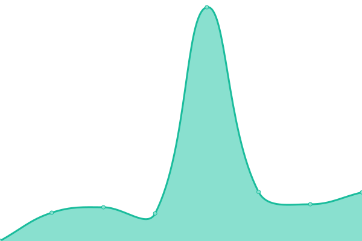
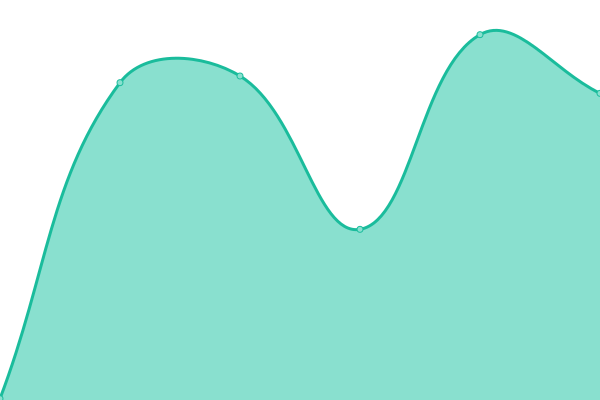
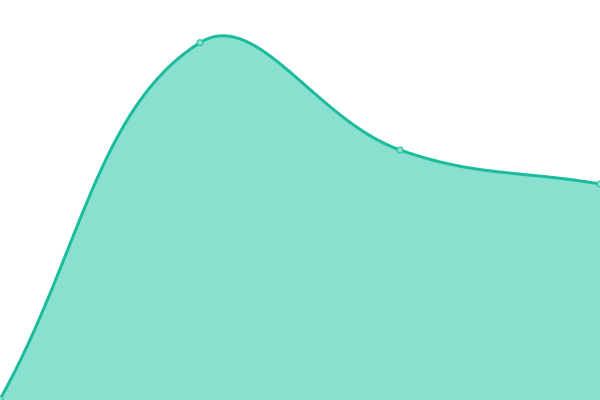
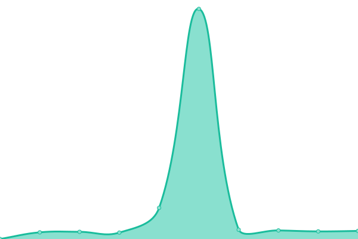
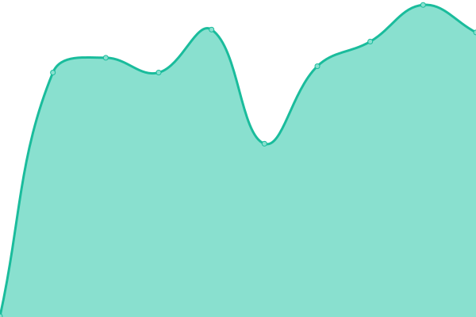
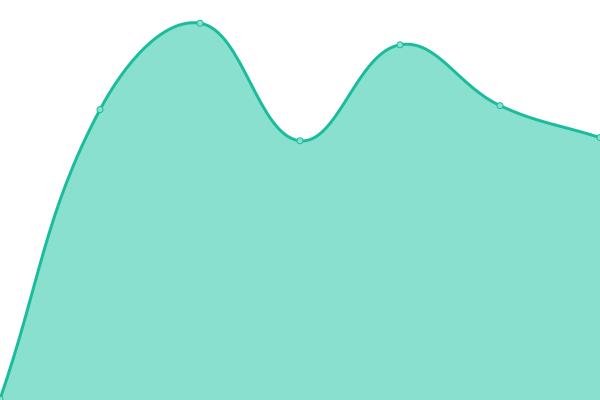

# [📈 Live Status](https://demo.upptime.js.org): <!--live status--> **🟩 All systems operational**

This repository contains the open-source uptime monitor and status page for [Upptime](https://upptime.js.org), powered by [Upptime](https://github.com/upptime/upptime).

With [Upptime](https://upptime.js.org), you can get your own unlimited and free uptime monitor and status page, powered entirely by a GitHub repository. We use [Issues](https://github.com/upptime/upptime/issues) as incident reports, [Actions](https://github.com/upptime/upptime/actions) as uptime monitors, and [Pages](https://demo.upptime.js.org) for the status page.

<!--start: status pages-->
<!-- This summary is generated by Upptime (https://github.com/upptime/upptime) -->
<!-- Do not edit this manually, your changes will be overwritten -->

| URL                                                                | Status | History                                                                                                                        | Response Time                                                                                    | Uptime                                                                                                                                                                                                                                                   |
| ------------------------------------------------------------------ | ------ | ------------------------------------------------------------------------------------------------------------------------------ | ------------------------------------------------------------------------------------------------ | -------------------------------------------------------------------------------------------------------------------------------------------------------------------------------------------------------------------------------------------------------- |
| [Ryan Yao Design](https://ryanyao.design)                          | 🟩 Up  | [ryan-yao-design.yml](https://github.com/lucky13820/uptime/commits/master/history/ryan-yao-design.yml)                         |  188ms             |                          |
| [Ryan Yao Photos](https://ryanyao.photos)                          | 🟩 Up  | [ryan-yao-photos.yml](https://github.com/lucky13820/uptime/commits/master/history/ryan-yao-photos.yml)                         |  373ms             |                          |
| [Designer Slack Communnities](https://www.designerslack.community) | 🟩 Up  | [designer-slack-communnities.yml](https://github.com/lucky13820/uptime/commits/master/history/designer-slack-communnities.yml) |  230ms |  |
| [RSSHub](https://rsshub.ryanyao.xyz)                               | 🟩 Up  | [rss-hub.yml](https://github.com/lucky13820/uptime/commits/master/history/rss-hub.yml)                                         |  233ms                     |                                           |
| [gram](https://gram.ryanyao.xyz)                                   | 🟩 Up  | [gram.yml](https://github.com/lucky13820/uptime/commits/master/history/gram.yml)                                               |  330ms                        |                                                 |
| [Search](https://search.ryanyao.xyz)                               | 🟩 Up  | [search.yml](https://github.com/lucky13820/uptime/commits/master/history/search.yml)                                           |  213ms                      |                                             |
| [tube](https://tube.ryanyao.xyz)                                   | 🟩 Up  | [tube.yml](https://github.com/lucky13820/uptime/commits/master/history/tube.yml)                                               |  238ms                        |                                                 |
| [Kingge](https://www.kingge.com)                                   | 🟩 Up  | [kingge.yml](https://github.com/lucky13820/uptime/commits/master/history/kingge.yml)                                           |  328ms                      |                                            |

<!--end: status pages-->

[**Visit our status website →**](https://demo.upptime.js.org)

## 📄 License

- Powered by: [Upptime](https://github.com/upptime/upptime)
- Code: [MIT](./LICENSE) © [Upptime](https://upptime.js.org)
- Data in the `./history` directory: [Open Database License](https://opendatacommons.org/licenses/odbl/1-0/)
