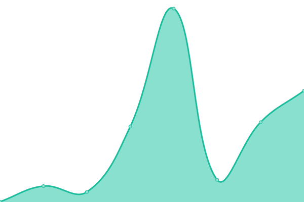
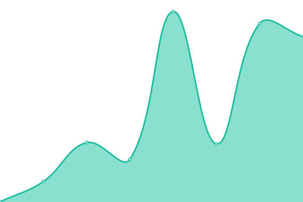
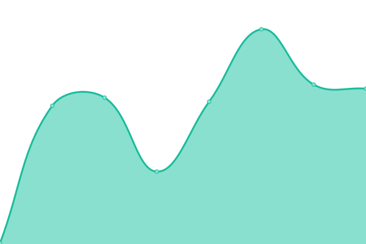
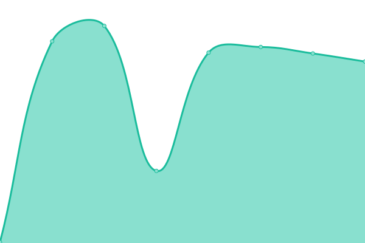
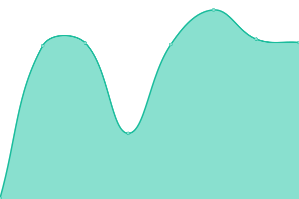
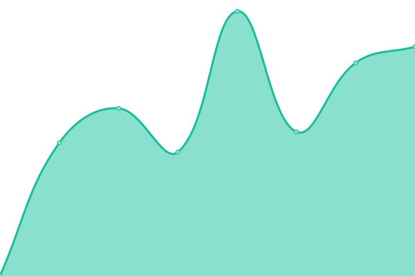

# [📈 Live Status](https://demo.upptime.js.org): <!--live status--> **🟧 Partial outage**

This repository contains the open-source uptime monitor and status page for [Upptime](https://upptime.js.org), powered by [Upptime](https://github.com/upptime/upptime).

With [Upptime](https://upptime.js.org), you can get your own unlimited and free uptime monitor and status page, powered entirely by a GitHub repository. We use [Issues](https://github.com/upptime/upptime/issues) as incident reports, [Actions](https://github.com/lucky13820/uptime/actions) as uptime monitors, and [Pages](https://demo.upptime.js.org) for the status page.

<!--start: status pages-->
<!-- This summary is generated by Upptime (https://github.com/upptime/upptime) -->
<!-- Do not edit this manually, your changes will be overwritten -->
<!-- prettier-ignore -->
| URL | Status | History | Response Time | Uptime |
| --- | ------ | ------- | ------------- | ------ |
|  [Ryan Yao Design](https://ryanyao.design) | 🟩 Up | [ryan-yao-design.yml](https://github.com/lucky13820/uptime/commits/HEAD/history/ryan-yao-design.yml) | 

 264ms
     
 | 

<a href="https://lucky13820.github.io/uptime/history/ryan-yao-design">100.00%</a>
    

|  [Ryan Yao Photos](https://ryanyao.photos) | 🟩 Up | [ryan-yao-photos.yml](https://github.com/lucky13820/uptime/commits/HEAD/history/ryan-yao-photos.yml) | 

 437ms
     
 | 

<a href="https://lucky13820.github.io/uptime/history/ryan-yao-photos">100.00%</a>
    

|  [Designer Slack Communnities](https://www.designerslack.community) | 🟩 Up | [designer-slack-communnities.yml](https://github.com/lucky13820/uptime/commits/HEAD/history/designer-slack-communnities.yml) | 

 556ms
     
 | 

<a href="https://lucky13820.github.io/uptime/history/designer-slack-communnities">100.00%</a>
    

|  [RSSHub](https://rsshub.ryanyao.xyz) | 🟩 Up | [rss-hub.yml](https://github.com/lucky13820/uptime/commits/HEAD/history/rss-hub.yml) | 

 227ms
     
 | 

<a href="https://lucky13820.github.io/uptime/history/rss-hub">100.00%</a>
    

|  [gram](https://gram.ryanyao.xyz) | 🟥 Down | [gram.yml](https://github.com/lucky13820/uptime/commits/HEAD/history/gram.yml) | 

 201ms
     
 | 

<a href="https://lucky13820.github.io/uptime/history/gram">0.00%</a>
    

|  [Search](https://search.ryanyao.xyz) | 🟩 Up | [search.yml](https://github.com/lucky13820/uptime/commits/HEAD/history/search.yml) | 

 829ms
     
 | 

<a href="https://lucky13820.github.io/uptime/history/search">100.00%</a>
    

|  [tube](https://tube.ryanyao.xyz) | 🟥 Down | [tube.yml](https://github.com/lucky13820/uptime/commits/HEAD/history/tube.yml) | 

 0ms
     
 | 

<a href="https://lucky13820.github.io/uptime/history/tube">0.00%</a>
    

|  [n8n](https://n8n.ryanyao.xyz) | 🟩 Up | [n8n.yml](https://github.com/lucky13820/uptime/commits/HEAD/history/n8n.yml) | 

 224ms
     
 | 

<a href="https://lucky13820.github.io/uptime/history/n8n">100.00%</a>
    

|  [Kingge](https://www.kingge.com) | 🟩 Up | [kingge.yml](https://github.com/lucky13820/uptime/commits/HEAD/history/kingge.yml) | 

 432ms
     
 | 

<a href="https://lucky13820.github.io/uptime/history/kingge">100.00%</a>
    

<!--end: status pages-->

[**Visit our status website →**](https://demo.upptime.js.org)

## 📄 License

- Powered by: [Upptime](https://github.com/upptime/upptime)
- Code: [MIT](./LICENSE) © [Upptime](https://upptime.js.org)
- Data in the `./history` directory: [Open Database License](https://opendatacommons.org/licenses/odbl/1-0/)
